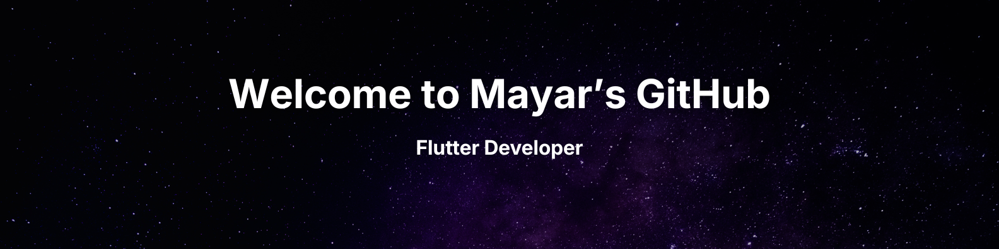

  

--- 

  <h3>🔗 Connect with me</h3>
  
  
  

---

  <h2 style="border-bottom: none; margin: 0; padding: 0;"><strong>About me</strong></h2>
  

  
Hello, I'm <b>Mayar Abdelrahim</b> — a Flutter Mobile Developer focused on building clean, structured, and production-ready cross-platform applications.

  
I highly value clean code, scalable architecture, and solving real-world technical challenges.

   

  📱 <b>Flutter Mobile Developer</b> with a focus on Clean Code & Architecture
   
  🎓 <b>Computer Science Student</b> at Faculty of Computers and Information, Qena University
   
  🏆 Ranked <b>Top 10</b> out of 24+ teams in a 4-day Hackathon (Clinic Booking System)
   
  👥 <b>Team-oriented</b> — Work well in teams and collaborate with others using <b>Git & GitHub</b> to organize workflows
   
  👥 <b>Technical Mentor & Instructor</b> at <b>Support Community - SVU</b> — Taught OOP, Data Structures, and Flutter to 30+ students
   
  🎯 <b>Problem Solving Mentor</b> at <b>ICPC SVNU</b> & Competitor in <b>ECPC Qualifications</b> two times with <b>ICPC SVU Community</b>
   
  💡 Recently studied and explained <b>SOLID Principles</b> to my peers

---

  <h2 style="border-bottom: none; margin: 0; padding: 0;"><strong>Technologies</strong></h2>
  

  <!-- Core Technologies -->
  <h3>Core Technologies</h3>
  
  
  
  
  

    

  <!-- Frameworks & Libraries -->
  <h3>Frameworks & Libraries</h3>
  
  
  

---

  <h2 style="border-bottom: none; margin: 0; padding: 0;"><strong>Featured Projects</strong></h2>
  

  <!-- LMS Project -->
  <h3>🎓 Learning Management System (LMS)</h3>
  
<i>University Field Training Project</i>

  
Developed a multi-app system (Student & Admin/Instructor apps) with secure authentication, courses management, quizzes, and progress tracking. Built with a highly scalable shell-routed architecture using Cubit & BLoC.

   

  <!-- Roshetta Project -->
  <h3>🏥 Clinic Booking System (Roshetta)</h3>
  
<i>4-Day Hackathon Project</i>

  
Collaborated in a team of 6 to design and build a complete medical booking system from scratch. Evaluated on architecture and clean code, ranking in the <b>Top 10</b> out of 24+ competing teams.

---
  

  <h3>💜 Thanks for visiting my profile! Have a great day! 💜</h3>

